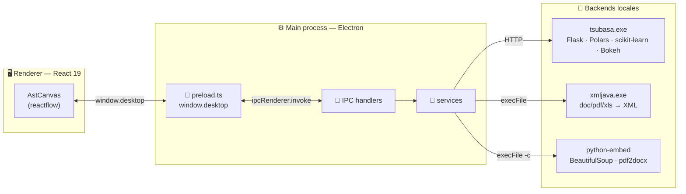
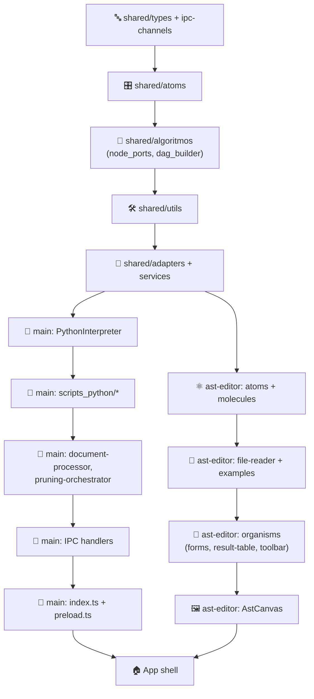
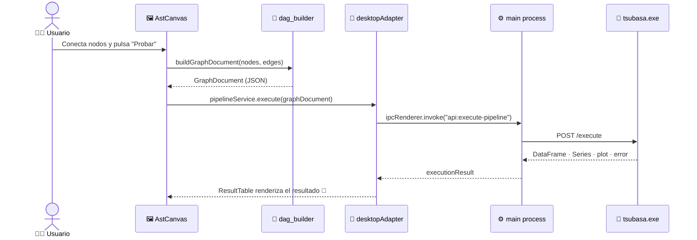

# ⚡ Denki Pipeline Designer

<p align="center">
  <em>Diseña pipelines de datos — con pasos de Machine Learning incluidos — arrastrando nodos,<br/>no escribiendo scripts.</em>
</p>

<p align="center">
  
  
  
  
  
</p>

---

## 📖 Tabla de contenidos

- [✨ ¿Qué es Denki?](#-qué-es-denki)
- [🧩 Características](#-características)
- [🏗️ Arquitectura](#️-arquitectura)
- [📂 Estructura del proyecto](#-estructura-del-proyecto)
- [🚀 Empezando](#-empezando)
- [📝 Convención de commits](#-convención-de-commits)
- [🔗 Proyectos relacionados](#-proyectos-relacionados)
- [🗺️ Documentos relacionados](#️-documentos-relacionados)
- [📜 Licencia](#-licencia)

---

## ✨ ¿Qué es Denki?

**Denki** es una aplicación de escritorio Electron que te deja **diseñar visualmente pipelines de transformación de datos** (sobre [Polars](https://pola.rs)) — **incluyendo pasos de Machine Learning como nodos más del mismo pipeline** — conectando nodos en un canvas al estilo n8n/Node-RED, y ejecutarlos de verdad contra un backend Python local.

El canvas serializa el grafo de nodos a un contrato JSON (`GraphDocument`) que el backend interpreta como un **árbol de sintaxis abstracta (AST)** de operaciones Polars. De ahí el nombre "AST Editor" que vas a ver por todo el código. 🌳

## 🧩 Características

- 🎨 **Canvas drag & drop** sobre [reactflow](https://reactflow.dev), con nodos DataFrame y Series conectables
- 🐼 **Pipelines Polars completos**: scan, filter, group_by, joins, window functions, strings, fechas, listas, structs...
- 🤖 **Nodos de Machine Learning**: clasificación, clustering, reducción de dimensiones, vectorización de texto
- 📊 **Visualizaciones Bokeh** embebidas (scatter, line, pie, histograma, matriz de confusión)
- 📄 **Extracción de documentos**: PDF/DOCX/XLS → texto plano, vía un binario Java + Python embebido
- 🧪 **Biblioteca de ejemplos** precargados (chains OR/AND, limpieza de Series, ML, subgrafos DAG)
- 🔍 **Modo SQL / árbol AST**: inspecciona cómo se traduce tu canvas antes de ejecutarlo
- 🧵 **Grafos con múltiples salidas**: un mismo pipeline puede bifurcarse a varios sinks

## 🏗️ Arquitectura

### 🔭 Vista general de procesos

Electron corre dos procesos que **nunca** se hablan directamente — todo pasa por `contextBridge` + IPC:



> El proceso `main` **nunca** ejecuta lógica de negocio: solo orquesta subprocesos y expone resultados al renderer.

### 🧱 Capas de código (base → consumidores)

Así se relacionan las capas del código, de lo más base a lo más consumido:



### 🔁 Ciclo de vida de una ejecución



## 📂 Estructura del proyecto

```text
src/
├── index.ts                 # 🚪 Composition root del proceso MAIN
├── preload.ts                 # 🌉 contextBridge → window.desktop
├── renderer.tsx                 # 🎬 Entry point del proceso RENDERER
├── App.tsx, pages/               # 🏠 Shell de la app
├── main/                       # ⚙️ Todo lo que corre en el proceso main
│   ├── config.ts                 #   puertos libres para tsubasa
│   ├── handlers/                  #   un archivo por dominio IPC
│   ├── services/                   #   PythonInterpreter, BackendManager...
│   └── scripts_python/              #   generación de scripts Python "a mano"
├── shared/                      # ♻️ Código compartido main ⇄ renderer
│   ├── types/, ipc-channels.ts
│   ├── atoms/                     #   🎛️ primitivos de UI
│   ├── algoritmos/                  #   🧮 node_ports.ts, dag_builder.ts
│   ├── utils/, adapters/, services/, hooks/
└── ast-editor/                   # 🎨 Dominio del editor visual (AST Editor)
    ├── atoms/, molecules/, organisms/, templates/
    ├── file-reader/                 #   lectura de documentos
    └── examples/                    #   pipelines de ejemplo
```

## 🚀 Empezando

### Instalación

```bash
npm install
```

### Comandos disponibles

| Comando | Qué hace |
|---|---|
| `npm start` | 🏃 Arranca la app en modo desarrollo (`electron-forge start`) |
| `npm run package` | 📦 Empaqueta la app sin generar instalador |
| `npm run make` | 🛠️ Genera instaladores (Squirrel, deb, rpm, zip) |
| `npm run publish` | 🚢 Publica una release |
| `npm run lint` | 🔍 ESLint sobre todo `.ts`/`.tsx` |

> ⚠️ **Sobre `bin/`**: `tsubasa.exe` (compilado desde [TsubasaEngine](https://github.com/Edahi98/TsubasaEngine)), `xmljava.exe` y el Python embebido **no están versionados en este repositorio** — pesan más de 1GB en conjunto y algunos binarios superan el límite de 100MB de GitHub. Descárgalos como assets del [release `v0.1.0`](../../releases/tag/v0.1.0) o colócalos manualmente en `bin/` antes de correr `npm start`. Detalle completo en [`docs/ARCHITECTURE.md`](docs/ARCHITECTURE.md).

## 📝 Convención de commits

Este proyecto adopta **[Conventional Commits](https://www.conventionalcommits.org/)** con scopes propios del dominio, pensados para reflejar el árbol de dependencias real del código (mapeado con [Codegraph](https://github.com)) en vez de la estructura de carpetas.

| Tipo · scope | Se usa para |
|---|---|
| `chore` | Tooling y configuración de build (sin dependencias de código) |
| `feat(shared-types)` | Contratos de tipos e IPC compartidos |
| `feat(shared-ui)` | Átomos de UI (`shared/atoms`) |
| `feat(shared-algo)` | Algoritmos de grafo y registro de puertos |
| `feat(shared-utils)` | Utilidades compartidas |
| `feat(shared)` | Adapters / services / hooks compartidos |
| `feat(main)` | Proceso main de Electron (servicios, IPC, bridges Python) |
| `feat(ast-editor)` | Dominio del editor visual |
| `feat(app)` | Shell de la aplicación |
| `docs` | Documentación |

Ejemplos:

```text
feat(shared-algo): add canvas-to-AST graph builder
feat(main): add Python interpreter service
feat(ast-editor): add node handle atom and AST node card
feat(app): add app shell, editor page, renderer, assets
```

## 🔗 Proyectos relacionados

- 🐍 **[TsubasaEngine](https://github.com/Edahi98/TsubasaEngine)** — el motor de ejecución (`tsubasa.exe`) que este proyecto arranca y consume vía IPC/HTTP. Contiene el código fuente del intérprete de AST sobre Polars (`polars_ast`), su extensión nativa en Rust (`series_ast`) y la API Flask que `main/services/api-client.ts` y `main/services/backend-manager.ts` orquestan desde aquí.

## 🗺️ Documentos relacionados

- 📘 [`docs/ARCHITECTURE.md`](docs/ARCHITECTURE.md) — arquitectura detallada, capa por capa
- 🧪 [`PROPUESTA_ALGORITMO_SERIALIZACION.md`](PROPUESTA_ALGORITMO_SERIALIZACION.md) — propuesta para unificar los dos serializadores AST hoy divergentes

## 📜 Licencia

MIT © [Edahi98](https://github.com/Edahi98)

---

<p align="center">Hecho con ⚡, demasiados nodos conectados y un poco de <code>polars.LazyFrame</code></p>
